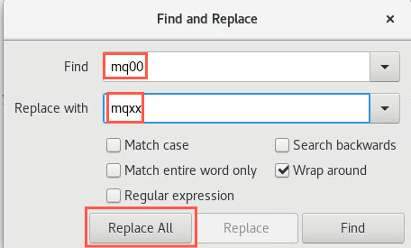
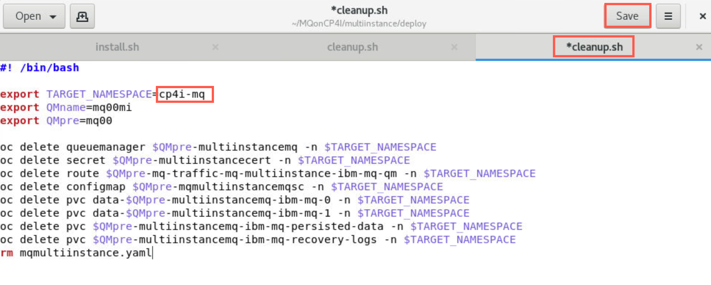
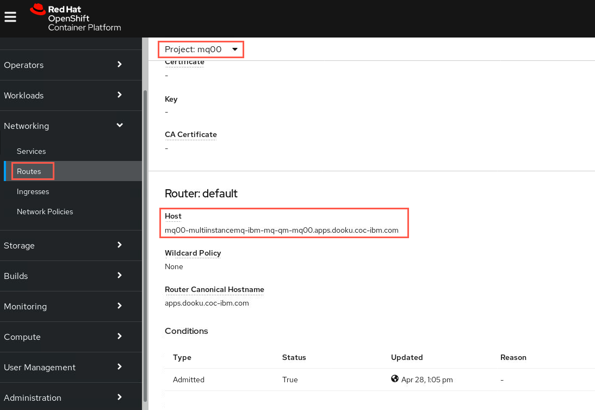
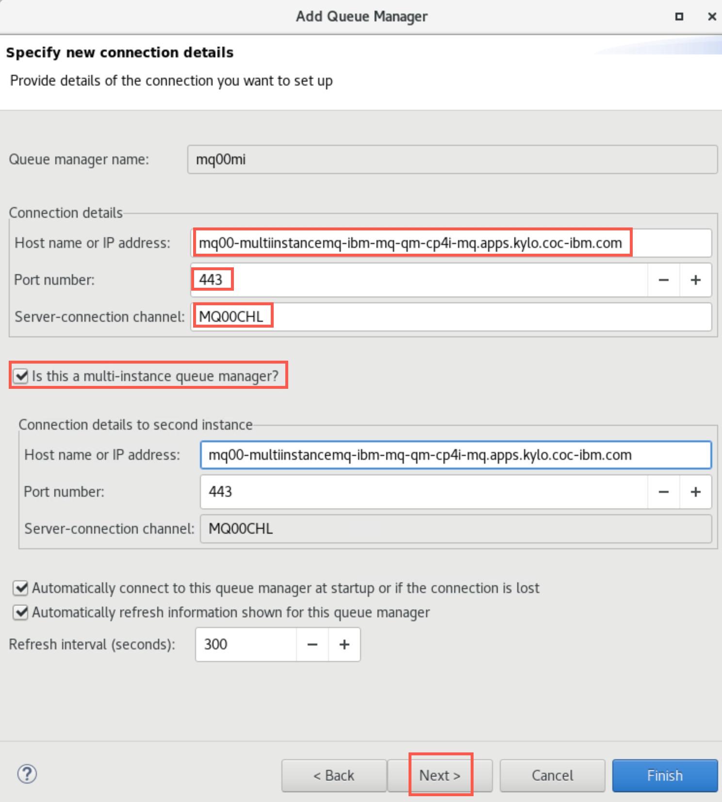
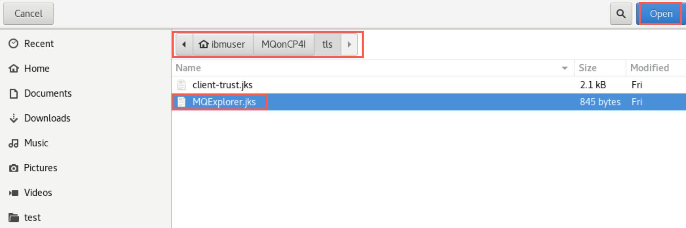
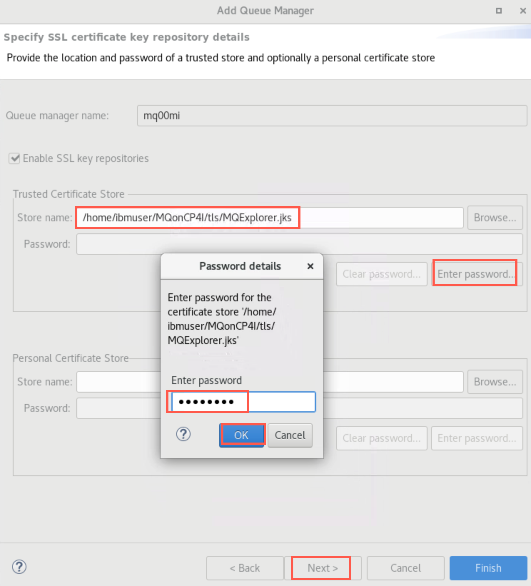
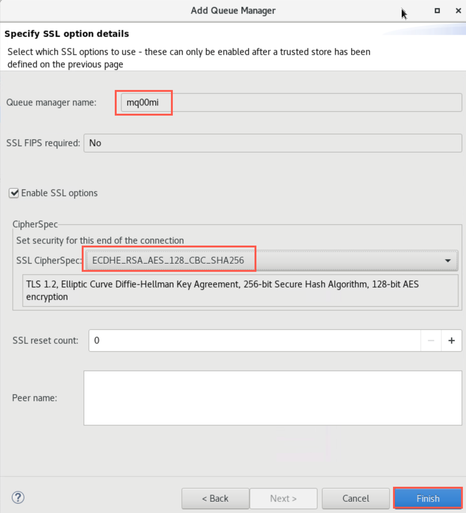
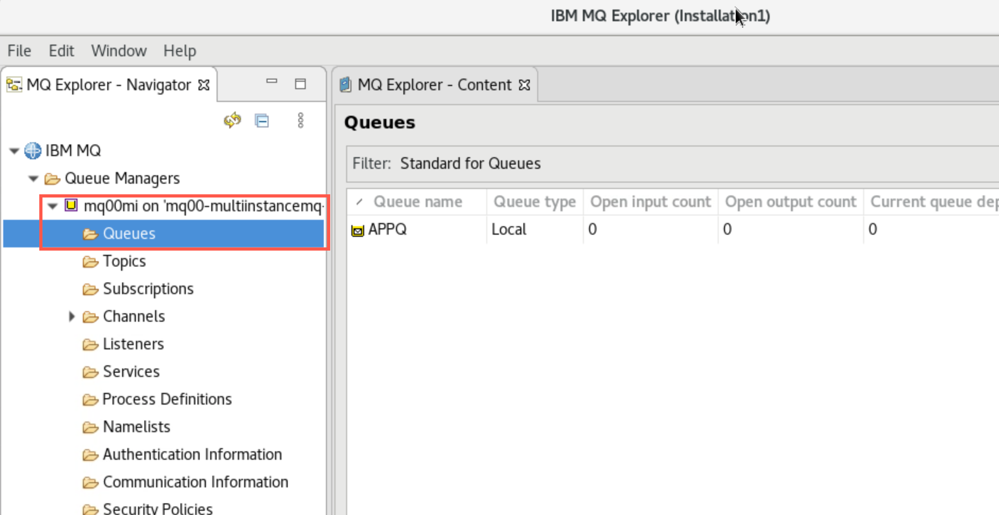

# Lab 2 - Creating a Multiinstance Queue Manager Using YAML
[Return to main lab page](../index.md)

Kubernetes uses replicas to keep a queue manager running. But this does not provide a full high availability environment. Multi-instance queue managers can be configured in the Cloud Pak for Integration for HA. 

## Lab objectives

These instructions will document the process to deploy a highly available (HA) persistent IBM MQ on the Cloud Pak for Integration (CP4I).

You will know how to set up MQ in a highly available topology where there is an active and passive container running.


## Deploy the MQ Queue Manager with associated resources

### Define the queue manager instance of CP4I in a yaml file

To create a MQ cluster, you could use the UI as you did in Lab 1 to create each queue manager in your cluster. Most administrators use scripting to define things which novice users would do with the UI.

This lab shows you how to write yaml to create the multi-instance queue manager.

1. You should still be logged into the OpenShift environment. If not, click on your username on the top right menu of the OpenShift Console, then click on *Copy Login Command*. 

	

1. Click *Display Token*, copy the token and run it on your terminal.
	
	
	
	**NOTE** "You should still be in project *mqxx* so you shouldn't need to run this command."
	
	
	Run the following command to navigate to the *mq00* project substituting your student number for 00:
	
	```
	oc project mq00
	``` 

1. Open a new terminal window by double-clicking the icon on the desktop.

	

1. Navigate to the *mqoncp4i-main/MQonCP4I/multiinstance/deploy* directory using the following commnand:

	```
	cd mqoncp4i-main/MQonCP4I/multiinstance/deploy
	```
	
1. Enter the following command to display the permissions for the files:

	```
	ls -al
	```
	
	
	
1. Make *installl.sh* and *cleanup.sh* executable with the following commands.

	```
	chmod +x install.sh
	```
	
	```
	chmod +x cleanup.sh
	```

	
	
1. Enter the following command to edit the file *install.sh*.

	```
	gedit install.sh
	```
	
		
1.	Click the hamburger menu in top right corner and select *Find and Replace*.
	
			
1. Enter *mq00* in the "Find" field and *mqxx* in the "Replace with" field. Use your student number in place of 00. Click *Replace All*, then click *Save*.

	
	
1. In the editor click the drop-down in the *Open* box, type "c", then select **cleanup.sh**.

	

1. As above change "00" in the export commands to your student ID. Click *Save*.

	
	
1. As done previously click drop-down next to *Open*, click *Other Documents*, then select *mqmultiinstance.yaml_template*.

	
	
1. Do not change anything in this file! The *install.sh* script will copy this file to *mqmultiinstance.yaml*, substitute your student ID in the environment varibles, and apply the yaml file to the OpenShift cluster. Review the file to understand how your queue manager will be created. 

	Pay particular attention to each *kind* stanza
	* 	**ConfigMap** for *mqsc* commands
	*  **Secret** to define the *tls* certificate and key
	*  **QueueManager** to define attributes for your specific QM
	*  **Route** to accesss the queue manager from outside the cluster

	In the *QueueManager* stanza, notice the name, the type (MultiInstance) and references to the *ConfigMap* and *Secret*.
	
1. Open a new terminal window and navigate to the deploy directory again with the command: 

	```
	cd mqoncp4i-main/MQonCP4I/multiinstance/deploy
	```

1. Run the *install.sh* script:

	```
	./install.sh
	```
	
	
	
	The results are displayed showing the objects (mentioned above) which were created.
		
1. Open your web browser tab for the Platform Navigator. Refresh the page. The status for *mq00-multiinstancemq* will have a status of *Pending* until completely deployed. 
	
1. After a couple of minutes the instance is deployed and the status changes to *Ready*. 

	

	**NOTE** "If you have closed the Platform Navigator, you can change to the OCP Console > Project cp4i > Networking > Routes > integration-navigator-pn. See screen shot below."
	
	
	
	
### Access and display your MQ instance in the Platform Navigator

1. Click the hyperlink for your instance which will take you to the MQ Console for your queue manager, but first you must respond to the security warning. Click *Advanced* then *Accept thee Risk and Continue*.

1. You are then taken to the MQ Console for your queue manager. Recall that you named the queue manager with your student ID prefix and *mi* - **mq00mi**. The instance name, **mq00mi**, is the same as the queue manager name. Click *Manage*.

	

1. On the *Manage* page you will see *Queues*, *Topics*, *Subscriptions*, and *Communications*. Under *Queues* you will see **APPQ** which was defined by the mqsc commands in the yaml defined *ConfigMap*. 

	
	
1. Click *Communication* > *App Channels** where you will find the channel **MQ00CHL**. The channel was also defined in the mqsc commands in the yaml defined *ConfigMap*. Click the elipsis on the right side then select *Configuration* to display or edit the channel properties. 

	
	
	Click the breadcrumb to return to *Manage* page.
	
	
	
	Notice the *Configuration* hyperlink in the top right corner. This takes you to the queue manager properties. Click the link now.
	
	
	
1. You arrive at the overall queue manager properties to be displayed or edited. Click *Security* > *Channel authentication*. Here you see the channel auth created by the mqsc commands in the yaml defined *ConfigMap* as well as the system channel auth records. Your yaml file defined the MQ00CHL record with a type of *Block*. You can click the wrench icon to display or edit the record. If you do change the properties you will then need to refresh security. To do that you simply click the *Actions* elipsis and select the necessary refresh option.

	
	
1. Continue to explore the MQ Console as long as you like.

### Review your MQ instance in OpenShift

There is an extensive amount of detail in the OpenShift Console. The following  instructions will lead you to accomplish the purpose of this lab. But feel free to explore more detail to help you understand OpenShift and CP4I. 

If running as part of a PoT there will be multiple mqxx namespaces and queue managers running so you need to be looking for your *mqxxmi* instance queue manager.
 	
1. Return to the browser tab in Firefox for the OCP Console. You will be in the *Administrator* view. Click *Projects* then scroll down to find **mqxx** and click the hyperlink. 

	
	
1. The project *Overview* opens where you can see the status and utilization of the **mq00** namespace (project).

	
	
1. On the left sidebar expand *Operators*, then select *Installed Operators*.
	
	
	
1. Scroll to find **IBM MQ** then click the hyperlink. 
	
	

	You can read about the *IBM MQ* operator and select the tabs to discover what information is available. Click the *Queue Manager* tab. You will see that your instance is running. 

	 
	
1. On the left sidebar expand *Workloads*, then select *Pods*. You will see two pods for your MQ instance. Each pod has a replica count of one, meaning there is one container in the pod and it is running your queue manager. Pod *mq00-multiinstancemq-ibm-mq-0* shows 1/1 while the other pod *mq00-multiinstancemq-ibm-mq-1* shows 0/1, meaning there is one container in the pod but it is not ready (in standby mode). 

	
	
1. You can also see this on the command line. In your terminal window enter the command using your student ID in place of *00*.

	```
	oc get pods | grep mq00
	```
	
	

1. In the OCP console, click the running pod *mq00-multiinstancemq-ibm-mq-0*. The *Pod Details* page opens showing resource utilitzation.

	
	
1. Scroll down to the *Volumes* section. Here you find *Persistent Volume Claims* (PVCs) for the pod. Notice the *Mount Path*. If you are familiar with multi-instance queue managers, you know that *mq00-multiinstancemq-ibm-mq-persisted-data* and *mq00-multiinstancemq-ibm-mq-recovery-logs* are the shared data between active and standby queue managers.

	
	
	Verify this by repeating the above for pod *mq00-multiinstancemq-ibm-mq-1*.
	
## Test the deployment

1. In a terminal window navigate to */home/ibmuser/mqoncp4i-main/MQonCP4I/multiinstance/test* directory. You will find three files (and additional files for TLS): 

	* CCDT.JSON
	* getMessage.sh
	* sendMessage.sh

	Open them in gedit. 
	
	

1. In the *ccdt.json* file, you need to update the host next to *host:* with your host name. To get your host name, run the following command in a terminal window:

	```
	oc get route | grep mq00
	```
	
	Your host name should start with *mqxx-multiinstancemq-ibm-mq-qm* where xx is your student ID.
	
	
	
1.	It is much easier to read in the OpenShift console. Return to the web browser tab where the console is open. On the left sidebar, scroll down to *Networking*, use the drop-down to see the options, and select *Routes*. 

	Use the filter to search for your queue manager routes to limit your search much like you did using *grep* with the oc command. Click the route name hyperlink for *mqxx-multiinstancemq-ibm-mq-qm*.
	
	
	 
1. Under *Route Details* scroll down to *Router:default*. There you will find the *Host* URL. Copy the URL under *Host* to use in the ccdt.json file.
	 
	 
	 
1. Return to the editor and paste the value into the *host:* field of ccdt.json. Under *channel* > *name:* insert the name of your SVRCONN channel (MQxxCHL). Then input the value of your queue manager in the *queueManager:* field.

	
	
	Click *Save* to save ccdt.json.
	
1. Now edit *getMessage.sh* and *sendMessge.sh*. You need to change the same values in each file. In the export statements, change *00* to your student ID. Click the *Save* button for each file. 

	
	
1. In the terminal window in the *./test* directory make *sendMessage.sh* and *getMessage.sh* files executable with the following commnads:

	```
	chmod +x sendMessage.sh
	```
	
	```
	chmod +x getMessage.sh
	```
	
		
1. In the terminal window in the *./test* directory initiate the testing by running the following command: 

	```
	./sendMessage.sh
	```
	
	The script will then connect to MQ and start sending messages incessantly. Leave this window open to keep sending messages.

1. Open another command window, navigate to */home/student/mqoncp4i-master/MQonCP4I/multiinstance/test* directory and run the following command: 

	```
	./getMessage.sh
	```
	
	You should get a list of the all messages that have been previously sent before running the command and the ones that are being sent after. Leave this window open to keep getting the messages.
	
	

1. Return to the OpenShift Console, expand *Workloads* and select *Pods*. If necessary you can enter your prefix in the filter field so you only see your pods.

	 

1. To see how the pods work together in action, delete the active pod by clicking the elipsis next to the pod with 1/1 and click *Delete Pod*. Respond *Delete* in the confirmation pop-up. 

	

1. Once the active pod is deleted, the connection will then reconnect to the other pod for it to take over. Verify this by observing the active pod in the console.

	
	
1. Also observe the behavior of the running appplications in the terminals. They have reconnected to the other pod and continue to run.

	
		
1. Try deleting the current active pod and observe again that the standby pod takes over and the applications reconnect and continue. 

	
	
	
	
	And observer the applications reconneting again.
	
	

1. You can now stop the programs by entering *ctrl-c* in each terminal window. 

## Connecting MQ Explorer to a deployed Queue Manager in OpenShift

These steps document how you can connect MQ Explorer to a Queue Manager running in OpenShift.


1. Open a new terminal window.
	
1. Enter the following command to start MQ Explorer making sure to use the correct case:

	```
	MQExplorer
	```
	
		
1. When the utility is ready, right-click *Queue Managers* and select *Add Remote Queue Manager*.

	

1. Enter your queue manager name using your student ID. Click *Next*.

	

1. Recall the values from the ccdt.json file you previously updated. 
	Enter the value from the *host:* field in the *Host name of IP address*. This was the URL of the *Router Canonical Host* from the route. 
	Enter **443** for the *Port number*.
	Enter your SVRCONN channel name in the *Server-connection channel* field.
	Click the checkbox for Multi-instance queue manager.
	Enter the same details for the second instance.
	Click *Next* three times.
	
	
	
	[For more information refer to KnowledgeCenter](https://www.ibm.com/support/knowledgecenter/SSFKSJ_9.1.0/com.ibm.mq.ctr.doc/cc_conn_qm_openshift.htm)
		
1. Click the checkbox for *Enable SSL key repositories*. Click *Browse* and navigate to */home/ibmuser/MQonCP4I/tls* and select **MQExplorer.jks**. Then click *Open*.

	
	
1. Click the *Enter password* button and enter **password**. Click *OK* then *Next*.

	
	
1. On the next screen click the checkbox for *Enable SSL options*. Click the drop-down next to *SSL CipherSpec* and select **ECDHE_RSA_AES_128_CBC_SHA256**.

	
	
1. Click *Finish*. You will get a pop-up saying "Trying to connect to the queue manager".

	
	
1. After a few seconds you see that MQ Explorer has connected. The Queue Manager will be added and shown in the navigator.

	
	
1. Operate MQ Explorer as you normally would. Expand the queue manager and "explore" MQ looking at queues, channels, etc.

	

1. When done "exploring" you may close MQ Explorer.

## Cleanup

1. Return to the Platform Navigator. Under *Runtimes*, find your instance, click the elipsis on the right and select **Delete**. 

	
	
1. Enter the instance name to confirm the deletion.

	
	
	This will delete the queue manager pods and all related artifacts. This will help reduce load on the cluster as you continue the rest of the labs. This queue manager will not be needed again. 
	
1. You also need to cleanup *PVCs* which do not get deleted automatically. In one of the terminal windows navigate to */home/ibmuser/MQonCP4I/multiinstance/deploy* directory. Enter the following command:

	```
	./cleanup.sh
	```

	
   
[Continue to Lab 3](../Lab_3/mq_cp4i_pot_lab3.md)

[Return to main lab page](../index.md) 
