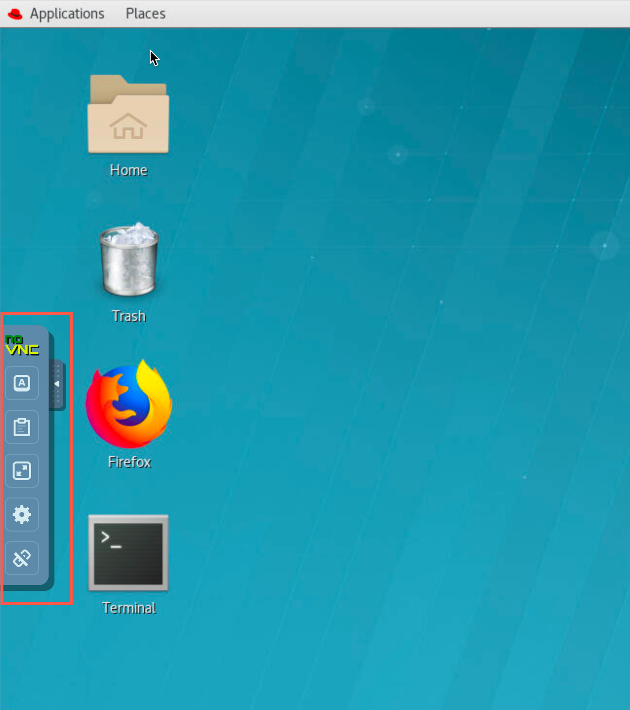
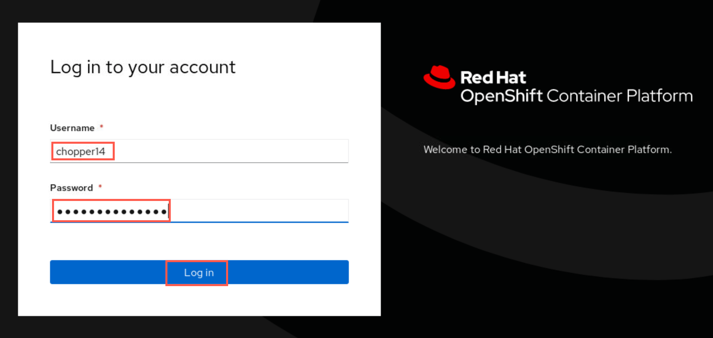
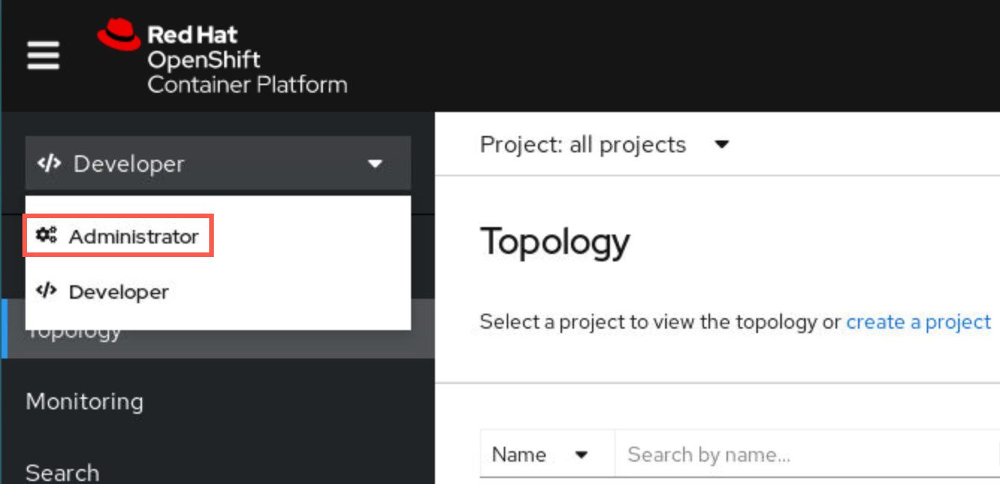
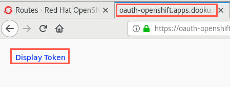

# Setup environment for CP4I PoT

## Connect to your Virtual Desktop Image

1. As a CP4I PoT attendee you should have received an email with instructions to connect to a Virtual Desktop Instance which you will use to execute the labs in this PoT. The email provided the details for connecting to you VDI.

	**Note**:If you did not receive an email for the PoT or your email did not include the following information, your instructor will provide the required information.

1. Copy the password then click *Desktop* URL.

	

1. The VNC window appears. Click connect.

	

1. Paste or enter the password included in the details then click *Send Password*.

	

1. The Linux desktop appears. You are now logged in as *student*. You'll notice the toolbar on the left. This is used to control the VNC settings. You will use it mostly for copy/paste from outside the VNC desktop. You can hide the toolbar by clicking the arrow on the side of the toolbar.

	

## Connect to the Red Hat OpenShift cluster

Your attendee email also included a URL to connect to the Red Hat OpenShift cluster where you will execute the labs. The name of the cluster will vary depending on which one has been reserved. The example below shows the **Chopper** cluster.

**Note**:If you did not receive an email for the PoT or your email did not include the following information, your instructor will provide the required information.

You will also receive a userid to use throughout the PoT. Your email will include the name of the cluster and userid. The userids are defined in an LDAP for the cluster. For example if **Chopper** is the cluster, your email will specify chopper/chopperxx where xx is your student number. If the cluster is *chopper*, you will receive  **chopper/chopperxx**.

The userid will also be the assigned name of a project (namespace) for you to work in. The project will be yours alone throughout the PoT. No one else will have access to your project and you will not have access to any other student's project.

Important - "Cluster *chopper* and Project *chopper14* were the cluster and the project name used to document this setup. Your assigned cluster and userid/project could be different. Whereever you see *chopper* or *chopperxx* in the instructions or screen shots make sure to substitute the ones assigned to you!"

1. From your email, copy the URL for the OCP Console.

1. Paste the URL onto the clipboard of the VDI.

	

	Then copy/paste the URL into a browser tab and hit enter.

	

	If you receive a security warning, click *Advanced* then scroll down and click *Accept the Risk and Continue*.

	

	Repeat if challenged a second time.

1. Select **pot**.

	

1. Sign in to the cluster with your ID and password. The sample used was *chopper14*. Click *Log in*.

	

1. You could be presented with an introductory tour. If you are interested you can page through the short tips. Otherwise you can just click *Skip tour*.

	

1. If you have been logged into the *Developer* perspective, click the drop-down next to Developer and select *Administrator*.

	

1. You are now in the *Adminstrator* perspective and logged it with your assigned userid. Your project (namespace) is visible as well as *cp4i*, *cp4i-apic*, *cp4i-tracing*. You will only use your project (e.g *chopper5*) for this PoT.

	

	You will be in your assigned namespace. There are many other namespaces in OCP, but you will only be permitted to use yours so as not to affect the other users.

### Connect to the Red Hat OpenShift cluster thru *oc* command

1. In OCP console, click the drop-down next to your username and select "Copy Login Command".

	

	**Note**: In some cases you could be requested to log in again. Please introduce your usedid and password if needed.
1. A new browser tab opens. Click the *Display Token* hyperlink.

	

1. Copy the command under "Log in with this token".

	

1. Open a terminal window (Go to *Applications/Terminal*) and paste the command into the terminal and hit enter which logs you into the cluster.

	
	```
	oc login --toke=<token> --server=<server>
	```
1. Please review that you have been able to log in into the cluster. If *oc* command execution asks you to use insecure connections please answer "yes". Openshift cluster is presenting a self-signed certificated due this is a test environment.

  

<a name="download"></a>
## Download artifacts for MQ on CP4I PoT

You should be logged on your VDI as *student*.

1. Clean *Downloads* folder by running the following commands:

	```
	rm -r Downloads/MQonCP4I*
	rm -r Downloads/mqoncp4i-main*
	```

1. Open a Firefox browser tab and navigate to [MQonCP4i](https://ibm.box.com/v/mq-pot-es-assets).

	

1. Click *Download*.

	

1. Click *Save file* radio button then click *OK*.

	

1. Open a terminal window by double-clicking the icon on the desktop.

	

1. Enter the following command to see the zip file you just downloaded.

	```
	cd Downloads
	```

1. Enter the following command to unzip the downloaded file:

	```
	unzip mqoncp4i-main.zip
	```

	

1. Move the unzipped directory to your home directory with the following command:

	```
	cd mqoncp4i-main
	```

	```
	mv MQonCP4I/ ~/
	```

	

	This will create the directory **/home/student/MQonCP4I**. Change to your home directory and list the contents of the directory to verify that it contains *MQonCP4I*.

	```sh
	cd ~
	ls
	```

	

Great! You are now ready to start working with MQ in the labs. If running a PoT, attendees are now ready to start Lab 1 where they will create queue managers using their assigned IDs.

[Continue to Lab 1](../Lab_1/mq_cp4i_pot_lab1.md)

[Return to lab index page](../index.md)
